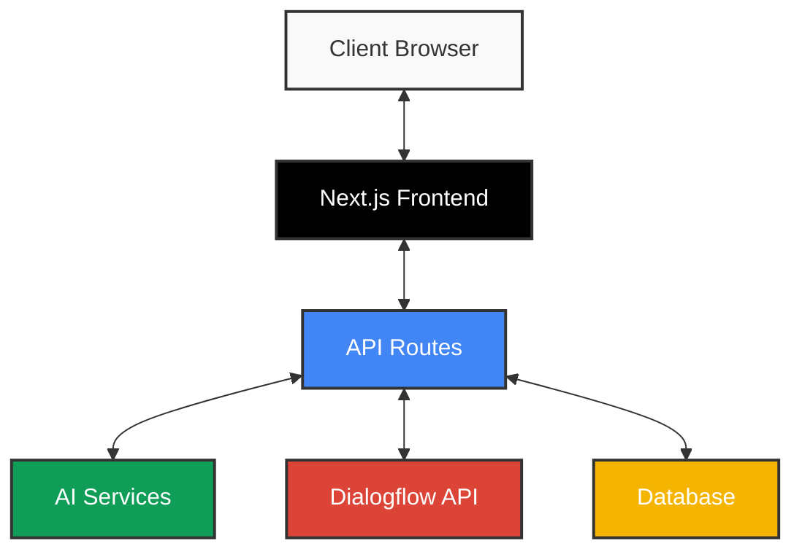

# 🤖 Dialogflow Developer Buddy (DDB)

<div align="center">
  
  
  
  
</div>

<p align="center">
  <i>Revolutionize your Dialogflow chatbot development with AI-powered tools and streamlined workflows.</i>
</p>

---

## 🌟 Overview

Dialogflow Developer Buddy is a comprehensive platform designed to accelerate and enhance your Dialogflow chatbot development process. Leveraging AI technologies, it provides intelligent tools for intent generation, entity detection, conversation flow design, and more.

<div align="center">
  
  ```mermaid
  graph TD
    A[Dialogflow Developer Buddy] --> B[Intent Generation]
    A --> C[Entity Detection]
    A --> D[Route Creation]
    A --> E[Webhook Generator]
    A --> F[Flow Generator]
    A --> G[Debug Tools]
    A --> H[Analytics Dashboard]
    A --> I[Test Suite]
  ```
  
</div>

## ✨ Key Features

| 🔑 Feature | 📝 Description | 🛠️ Technology |
|-----------|--------------|-------------|
| **🧠 Intent Generation** | AI-powered intent generation for your Dialogflow chatbot | Google Generative AI, OpenAI |
| **🔍 Entity Detection** | Automatically identify entities and parameters | NLP, Pattern Recognition |
| **🛣️ Route Creation** | Generate conversation flows and routes | Visual Flow Builder |
| **📡 Webhook Generator** | Create webhooks and fulfillment code | Code Generation, API Integration |
| **📊 Flow Generator** | Design and generate custom workflow diagrams | Interactive UI Builder |
| **🐞 Debugddy** | Advanced debugging tool for tracking and resolving issues | Real-time Analysis |
| **📈 Analytics Dashboard** | Track chatbot performance metrics and user interactions | Recharts, Data Visualization |
| **🧪 Test Suite** | Automated testing tools for validating chatbot responses | Automated Testing Framework |

## 🚀 Getting Started

Get your Dialogflow Developer Buddy up and running with these simple steps:

### Prerequisites

- Node.js 18.x or higher
- npm or yarn
- Google Cloud project with Dialogflow API enabled (for full functionality)

### Installation

1. Clone the repository:
   ```bash
   git clone https://github.com/Yash-Kavaiya/dialogflow-buddy.git
   cd dialogflow-buddy/dialogflow-buddy
   ```

2. Install dependencies:
   ```bash
   npm install
   # or
   yarn install
   ```

3. Set up environment variables:
   ```bash
   # Create a .env.local file with your API keys and configuration
   touch .env.local
   ```

4. Start the development server:
   ```bash
   npm run dev
   # or
   yarn dev
   ```

5. Open [http://localhost:3000](http://localhost:3000) in your browser to see the application.

## 🖥️ Technologies Used

<div align="center">
  <table>
    <tr>
      <td align="center"><b>Frontend</b></td>
      <td align="center"><b>AI & ML</b></td>
      <td align="center"><b>Development</b></td>
    </tr>
    <tr>
      <td>
        • Next.js 14<br>
        • React 18<br>
        • Tailwind CSS<br>
        • Recharts<br>
      </td>
      <td>
        • Google Generative AI<br>
        • OpenAI<br>
        • Natural Language Processing<br>
        • Pattern Recognition<br>
      </td>
      <td>
        • TypeScript<br>
        • ESLint<br>
        • Vercel Deployment<br>
        • Git Workflow<br>
      </td>
    </tr>
  </table>
</div>

## 📊 Architecture

The Dialogflow Developer Buddy follows a modular architecture with clear separation of concerns:



## 🤝 Contributing

Contributions are welcome! Here's how you can help improve Dialogflow Developer Buddy:

1. Fork the repository
2. Create your feature branch (`git checkout -b feature/amazing-feature`)
3. Commit your changes (`git commit -m 'Add some amazing feature'`)
4. Push to the branch (`git push origin feature/amazing-feature`)
5. Open a Pull Request

Please make sure to follow our code style and include appropriate tests.

## 📚 Documentation

Comprehensive documentation is available in the project:

- [User Guide](/docs/user-guide.md)
- [API Reference](/docs/api-reference.md)
- [Development Guide](/docs/development.md)

## 📜 License

This project is licensed under the MIT License - see the [LICENSE](LICENSE) file for details.

## 📮 Contact

<div align="center">
  <a href="https://github.com/Yash-Kavaiya">
    
  </a>
  <a href="https://x.com/Yash_Kavaiya_">
    
  </a>
  <a href="https://linkedin.com/in/yashkavaiya">
    
  </a>
  <a href="https://discord.gg/QfRd4S9A">
    
  </a>
</div>

---

<p align="center">
  <i>© 2025 Dialogflow Developer Buddy. All rights reserved.</i><br>
  <i>Making Dialogflow development easier and more efficient</i>
</p>
